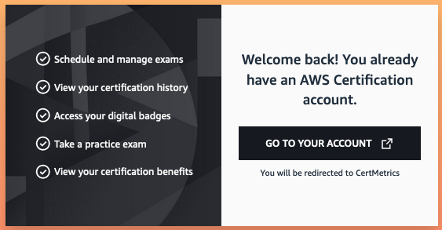

+++ 
title = "Agendar examen" 
chapter = true 
weight = 20 
+++

**Cómo agendar un examen de certificación de Amazon Web Services**

1. Ir a {}AWS Certification{}

1. Seleccione la opción **Sign In** que encontrará en la esquina superior derecha.

1. Si trabaja para un Partner de AWS, seleccione la opción **AWS Partner** y luego ingrese sus credenciales.

    

1. En la barra superior de la página de **AWS Training** seleccione **Certification**

1. Seleccione **GO TO YOUR ACCOUNT**

    

1. En la esquina superior derecha encontrará la opción para cambiar el idioma si así lo desea.

    

1. Seleccione **Inscribirse a un examen**

1. Encontrará todos los examenes disponibles, entre ellos el examen **AWS Certified Cloud Practitioner** así como la opción de seleccionar a cualquiera de los dos proveedores disponibles, **Pearson VUE** o **PSI**. Al seleccionar alguna de las dos opciones será redireccionado al sitio del proveedor que haya elegido. (Los siguientes pasos y capturas de pantalla son del proveedor **Pearson VUE**, puede seleccionar **PSI** como su proveedor y el menu podría variar ligeramente).

1. Cada proveedor cuenta con opciones para presentar el examen de forma presencial o virtual, seleccione la opción que mas le convenga.

1. Deberá seleccionar el idioma que desea presentar su examen, **AWS Certified Cloud Practitioner** está disponible para ser presentado en idioma **Español**.

1. Acepte los términos y condiciones.

1. Ambos proveedores cuentan con opciones para seleccionar el idioma del *supervisor* (o *proctor*) que lo acompañará durante su examen de forma remota. Sin embargo, solo en el caso de haber seleccionado **Pearson VUE** se tiene la opción de que el idioma sea **Español**.

    

1. Seleccione la zona horaria en la que se encuentre.

1. Seleccionar la fecha para presentar el examen y a continuación se habilitarán en el panel inferior los horarios disponibles para ese día.

    

1. Una vez seleccionada la hora y dar **Siguiente** se presentará el resumen del costo del examen para generar el pago. En caso de contar con voucher en el siguiente paso se habilitará la opción para agregar el código para su canje.

    {}En caso de que cuente con un voucher promocional, debe asegurarse de haber seleccionado el proveedor de examen correspondiente a dicho voucher.
    {}

    

1. Seleccionar **Continuar con el pago**

1. Ingrese la información para hacer el pago del examen y al ser confirmado recibirá un correo electrónico del proveedor con información relevante sobre el examen.

**¡MUCHO EXITO!**

Consulte además: <a href="https://aws.amazon.com/blogs/training-and-certification/5-tips-for-a-successful-online-proctored-aws-certification-exam/" target="_blank">5 recomendaciones para tener un examen virtual exitoso [en inglés]</a>
