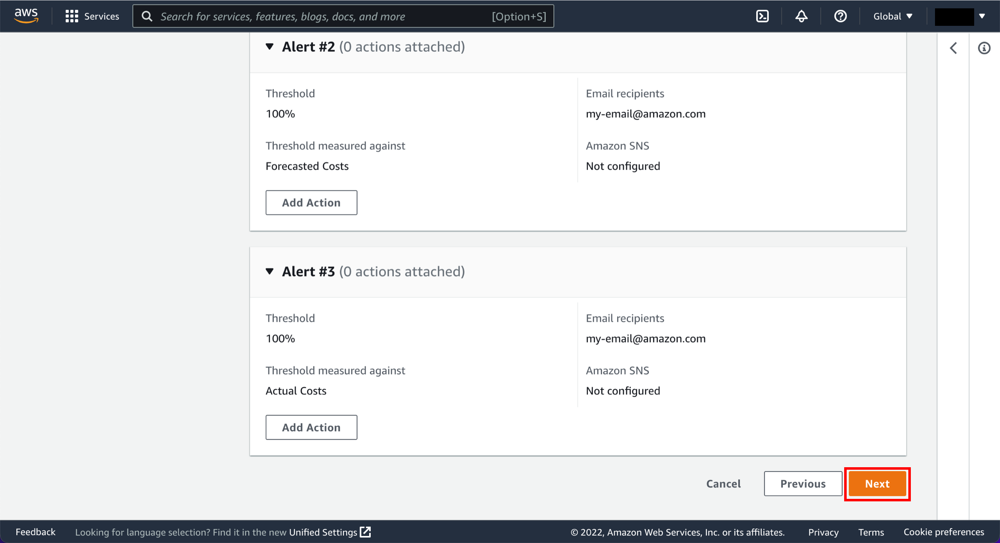

+++ 
title = "Mini Labs" 
chapter = true 
weight = 50
+++

## Laboratorios guiados

La certificación AWS Certified Solutions Architect Associate (SAA-C03) es la certificación más demandada en la industria de la informática en la nube. El objectivo de este sitio es poder llevar a cabo laboratorios guiados para que puedas poner en prácticas tus conocimientos.

El examen AWS Solutions Architect Associate es uno de los exámenes de certificación más desafiantes. Esta certificación pondrá a prueba los conceptos clave utilizados en la tecnología de AWS y cómo utiliza esas habilidades para diseñar la arquitectura. 

Es importante contar con los fundamentos de Amazon Web Services para aprovechar al máximo los Laboratorios

{} En cada laboratorio se mencionará si su ejecución se considera un costo mínimo o costo $0, MUY IMPORTANTE al terminar cada Laboratorio realizar el paso de **limpieza o Clean up** para eliminar las configuraciones y deshabilitación de servicios con la finalidad de no generar costos futuros.
{}

#### 
{} Antes de iniciar los Labs te recomendamos utilizar la **Capa Gratuita de AWS, monitorear tus gastos y establecer Presupuestos para tener mayor control de costos.**
{}

El monitoreo del uso de su servicio y los costos asociados mientras explora y escala su uso de AWS a menudo se menciona como una de las principales preocupaciones. Para asegurarse de no exceder los umbrales de uso de la Capa gratuita y su presupuesto general, le recomendamos utilizar los Presupuestos de AWS. Los Presupuestos de AWS son una herramienta de control de costos que le permite crear presupuestos de costo personalizados que le avisarán cuando exceda su umbral presupuestado.

Crear presupuestos de costo mensual total para cada cuenta de AWS que use es una práctica recomendada. Los presupuestos de AWS tienen un límite de Capa gratuita de 62 días de presupuesto por mes, por lo que la creación de un presupuesto único cabe dentro del límite de Capa gratuita de AWS. Como su nombre lo indica, el uso del servicio elegible para la Capa gratuita de AWS es gratuito.

## ¿Cómo aprovechar una cuenta AWS  dentro de la capa gratuita?
### Explore la Capa gratuita de AWS

En este paso, explorará los 3 tipos de ofertas en la Capa gratuita: siempre gratis, 12 meses gratis y pruebas.

#### a. Acceda a la página de la Capa gratuita
Abra la <a href="https://aws.amazon.com/es/free/?all-free-tier.sort-by=item.additionalFields.SortRank&all-free-tier.sort-order=asc&awsf.Free%20Tier%20Types=*all&awsf.Free%20Tier%20Categories=*all" target="_blank"> página de la Capa gratuita</a> y empiece a explorar las ofertas.

#### b. Explore las ofertas gratuitas

En la página de la Capa gratuita de AWS, bajo el encabezado Detalles de la Capa gratuita de AWS puede eligir los Tipos de Niveles de ofertas de servicios gratuitos por **12 MESES DE USO GRATUITO, GRATIS POR SIEMPRE  y PRUEBAS**.

1. En el caso de las ofertas de  <a href="https://aws.amazon.com/es/free/?all-free-tier.sort-by=item.additionalFields.SortRank&all-free-tier.sort-order=asc&awsf.Free%20Tier%20Types=tier%2312monthsfree&awsf.Free%20Tier%20Categories=*all" target="_blank"> 12 meses de uso gratuito </a>  están disponibles exclusivamente para los nuevos clientes de AWS y solo durante doce meses a partir de la fecha de inscripción en AWS. Cuando finalicen los 12 meses de uso gratuito o si el uso de su aplicación supera las capas, tendrá que pagar las tarifas de servicio estándar por uso (consulte la página de cada servicio para obtener información completa sobre los precios).

2. Al  seleccionar  <a href="https://aws.amazon.com/es/free/?all-free-tier.sort-by=item.additionalFields.SortRank&all-free-tier.sort-order=asc&awsf.Free%20Tier%20Types=tier%23always-free&awsf.Free%20Tier%20Categories=*all" target="_blank"> Gratis para siempre  </a>  como su nombre lo indica, estas ofertas no vencen automáticamente cuando finaliza el período de 12 meses de la Capa gratuita de AWS y están disponibles para todos los clientes de AWS.

3. Al seleccionar  <a href="https://aws.amazon.com/es/free/?all-free-tier.sort-by=item.additionalFields.SortRank&all-free-tier.sort-order=asc&awsf.Free%20Tier%20Types=tier%23trial&awsf.Free%20Tier%20Categories=*all" target="_blank"> Pruebas  </a>   dichas ofertas le permiten utilizar un servicio durante un período específico de tiempo o cantidad determinada de operaciones.

## ¿Cómo revisar los gastos y uso de la Capa Gratuita?
Por favor, <a href="https://signin.aws.amazon.com/signin?redirect_uri=https%3A%2F%2Fconsole.aws.amazon.com%2Fconsole%2Fhome%3FhashArgs%3D%2523%26isauthcode%3Dtrue%26state%3DhashArgsFromTB_us-east-2_691f3184ab83b0ba&client_id=arn%3Aaws%3Asignin%3A%3A%3Aconsole%2Fcanvas&forceMobileApp=0&code_challenge=14RRARavML8l5UECCXSnKKILN60TYc5Xl7GfxdxciAI&code_challenge_method=SHA-256" target="_blank"> Regístrese en AWS (o inicie sesión en la Consola)  </a>  

Utilizará la consola de facturación de AWS para revisar su gasto total de AWS y el uso de la Capa gratuita

#### a. Acceda al panel de facturación
Después de iniciar sesión en su cuenta, en el menú de la cuenta, seleccione **panel de facturación (Billing Dashboard)**.

#### b. Revise el panel de facturación
Una vez que llegue a la página *AWS Billing Dashboard*, puede ver un resumen de los costos mensuales hasta la fecha en la sección Resumen de AWS **(AWS Summary)**, así como la tendencia de los costos de sus cinco servicios principales para los últimos tres a seis períodos de facturación cerrados en la sección Tendencia de costos por los cinco servicios principales  **(Cost trend by top five services)** .

#### c. Acceda a la Capa gratuita **(Free Trier)**
Para profundizar en su uso elegible para el nivel gratuito, elija Nivel gratuito **(Free Tier)** en el panel de navegación izquierdo.

#### d. Analice todo sobre el uso de la Capa gratuita **(Free Tier usage)**
En la sección **Summary (Resumen)** de la página Capa gratuita de AWS **(Free Tier)**, se muestra todo el uso de los servicios de la capa gratuita. Además de su uso actual **(Current usage)**, el uso previsto del servicio para finales de mes se detalla en la columna Uso previsto **(Forecasted usage)**.

En la captura de pantalla de ejemplo, tenga en cuenta que el uso previsto de EC2 es de 2 GB-mes. Exceder el límite de la capa gratuita generalmente resulta en un cargo facturable.

#### e. Modifique sus alertas de correo electrónico del límite de uso de la Capa gratuita de AWS
De manera predeterminada, la mayoría de las cuentas se activan automáticamente para recibir alertas por correo electrónico respecto del límite de la Capa gratuita de AWS cuando el uso de su servicio excede el 85 % de un límite determinado.

Para cambiar quién recibe estas alertas por correo electrónico, seleccione Preferencias de Facturación **(Billing Preference)** en la barra de navegación izquierda.

Para que otras personas puedan recibir alertas de uso de la Capa gratuita, agregue su **dirección de correo electrónico** en el campo de Dirección de correo electrónico y seleccione **Guardar preferencias**.

ASDASDASDASDASDASD P R E S U P U E S T O ASDASDASDASDASDASD

## ¿Cómo crear un presupuesto en la Consola?
Cree presupuesto de costos en la Consola de facturación de AWS con los Presupuestos de AWS **(AWS Billing Console using AWS Budget)**. Como parte de su presupuesto de costos, establecerá tres notificaciones: 
1. Por si sus costos alcanzan el 50 % de su presupuesto, 
2. Por si se pronostica que sus costos excederán su presupuesto, 
3. Si sus costos exceden su presupuesto.

#### a. Crear Presupuesto
En el menú de navegación de la izquierda, seleccione Presupuestos **(Budgets)** y, a continuación, elija Crear un presupuesto **(Create a budget)**  en la página de la consola de AWS Budgets.  

#### b. Crear Tipo de Presupuesto
En la página Elegir tipo de presupuesto **(Choose budget type)**, elija Presupuesto de costos **(Cost budget)** en Tipos de presupuesto **(Budget types)**. 

#### c. Crear Tipo de Presupuesto
En la página Establecer presupuesto **(Set your budget)**, edite el campo Nombre del presupuesto **(Budget name)** para leer *MyMonthlyBudget*.
 
En la sección Establecer importe presupuestario, mantenga las selecciones predeterminadas para Período, Tipo de renovación presupuestaria, Mes inicial y Método de presupuestación **(Period, Budget renewal type, Start month, and Budgeting method)**. Ingrese $100 en el campo Ingrese su monto presupuestado ($). **Importante** la cantidad es un ejemplo sin embargo le recomendamos asignar la cantidad de USD que considere como presupuesto, podría ser $2 , $5 o $10 (es solo un ejemplo).
 
En la sección Ámbito presupuestari **(Budget scope)**, puede utilizar estas características para crear presupuestos que realicen un seguimiento de los costos asociados con un conjunto concreto de servicios de AWS, cuentas vinculadas, etiquetas u otras dimensiones de uso. Para este tutorial, mantenga estos valores como predeterminados y elija Siguiente. 

#### d. Configurar alerta para cuando el costo real supere el 80% del umbral presupuestario
En la página congfigure las alertas **(Configure alerts)**, puede hacer que AWS Budgets se ponga en contacto con usted y con otras personas por correo electrónico cuando se cumplan las condiciones presupuestarias.
 
Elija Agregar un umbral de alerta **(Add an alert threshold)**.

Configure la alerta para que se active cuando los costos reales sean superiores al 80% del importe presupuestado, como se muestra en la captura de pantalla. Agregue su dirección de correo electrónico y la dirección de correo electrónico de cualquier persona que deba recibir esta alerta en el campo Destinatarios de correo electrónico **(Email recipients)**.

#### e. Configure alertas para cuando el costo real supere su presupuesto
En la página Configurar alertas **(Configure alerts)**, elija Agregar umbral de alerta **(Add alert threshold)**.

Configure esta alerta para que se active cuando los costos previstos sean superiores al 100% del importe presupuestado, como se muestra en la captura de pantalla. Agregue su dirección de correo electrónico y la dirección de correo electrónico de cualquier persona que deba recibir esta alerta en el campo Destinatarios de correo electrónico **(Email recipients)**.

#### f. Configure alertas para cuando el costo real supere su presupuesto
En la página Configurar alertas **(Configure alerts)**, elija Agregar umbral de alerta **(Add alert threshold)**.

Configure esta alerta para que se active cuando los costos previstos sean superiores al 100% del importe presupuestado, como se muestra en la captura de pantalla. Agregue su dirección de correo electrónico y la dirección de correo electrónico de cualquier persona que deba recibir esta alerta en el campo Destinatarios de correo electrónico **(Email recipients)**.

#### g. Adjuntar acciones (opcional)
Elija Siguiente **(Next)** para ver la página de acciones adjuntas.

A budget action allows you to define and trigger cost-saving responses to reinforce a cost-conscious culture. You have the option to attach actions that run whenever your alert threshold has been exceeded, such as stopping an EC2 instance from incurring any further costs. You can select the alerts to which you would like to attach actions, then define these actions.

Elija Siguiente **(Next)** para revisar los detalles del presupuesto en la página Revisar.

 Revise su presupuesto y, a continuación, elija Crear presupuesto **(Create budget)** para crear el presupuesto y las alertas.
 
Una vez creado el presupuesto, verá una lista de presupuestos de AWS **(AWS Budgets)** que ha creado. Se recomienda crear un presupuesto de costos mensuales totales para cada cuenta de AWS que utilice.
 
Puede crear hasta 62 días de presupuesto al mes con el servicio AWS Budgets dentro del límite de la capa gratuita. Después de eso, simplemente paga sobre la marcha para crear presupuestos adicionales.

#### g. Inspeccione su nuevo presupuesto
Para profundizar en los detalles de su presupuesto, seleccione su nuevo presupuesto.

Desde allí, puede ver los detalles de su presupuesto, acceder a un resumen de rendimiento del presupuesto e inspeccionar el rendimiento histórico del presupuesto.

## Felicitaciones

Analizó con éxito su uso de la Capa gratuita y creó un presupuesto de costo mensual total con los Presupuestos de AWS.

La Consola de facturación de AWS le permite acceder a una serie de herramientas para ayudarlo a comprender mejor sus costos y uso, incluidos el widget de los principales servicios de Capa gratuita por uso y los Presupuestos de AWS.

La Capa gratuita de AWS le permite obtener experiencia práctica gratuita con la plataforma, los productos y los servicios de AWS.

