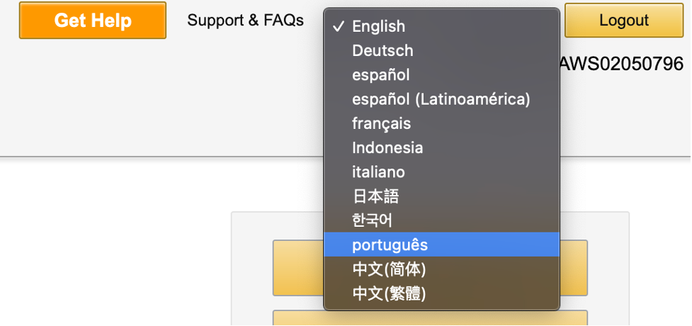
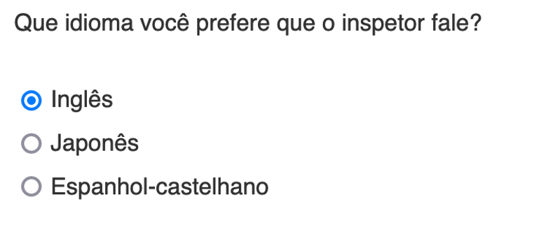
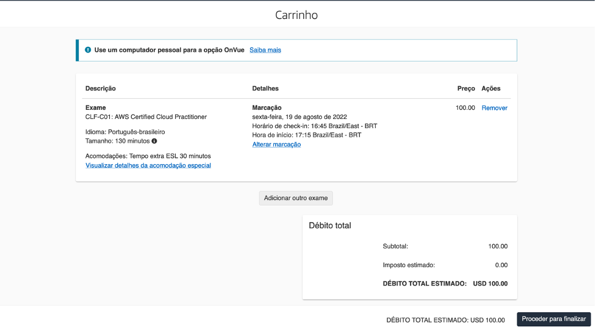

+++ 
title = "Agendar exame" 
chapter = true 
weight = 20 
+++

**Como agendar um exame de certificação da Amazon Web Services**

1. Ir a {}AWS Certification{}

1. Selecione a opção **Sign In** que está na parte superior direita.

1. Se você trabalha para um parceiro da AWS, selecione a opção AWS Partner e, em seguida, insira suas credenciais.

    

1. Na barra superior da página do **AWS Training** selecione **Certification**

1. Selecione  **GO TO YOUR ACCOUNT**

    

1. No canto superior direito, você encontrará a opção de alterar o idioma, se desejar.

    

1. Selecione **Inscrever-se para um exame**

1. Você encontrará todos os exames disponíveis, incluindo o exame **AWS Certified Cloud Practitioner** bem como a opção de selecionar um dos dois provedores disponíveis, **Pearson VUE** ou **PSI**. Ao selecionar uma das duas opções, você será redirecionado para o site do provedor que escolheu. (As etapas e capturas de tela a seguir são do provedor **Pearson VUE**, você pode selecionar **PSI** como seu provedor e o menu pode variar um pouco).

1. Cada provedor tem opções para fazer o exame presencial ou virtualmente, selecione a opção que mais lhe convier.

1. Você deve selecionar o idioma em que deseja realizar seu exame, o **AWS Certified Cloud Practitioner** está disponível para ser realizado em **português**.

1. Aceite os termos e condições.

1. Caso opte por realizar o exame de forma remota, ambos os provedores têm opções para selecionar o idioma do inspetor (ou proctor) que o acompanhará durante o exame remotamente. **Não há opção de Português para o proctor**.

    

1. Selecione o fuso horário em que você está.

1. Selecione a data para fazer o exame e, em seguida, os horários disponíveis para esse dia serão ativados no painel inferior.

    

1. Uma vez selecionado o horário e clique em **Avançar**, será apresentado o resumo do custo do exame para gerar o pagamento. Se você tiver um voucher, a opção de adicionar o código para resgate será habilitada na próxima etapa.

    {}No caso de possuir um voucher promocional, deve certificar-se de que selecionou o fornecedor de exames correspondente ao referido voucher.
    {}

    

1. Selecionar **Proceder para finalizar**.

1. Insira as informações para pagar o exame e após a confirmação você receberá um e-mail do provedor com informações relevantes sobre o exame.

**BOA SORTE!**

Veja também: <a href="https://aws.amazon.com/blogs/training-and-certification/5-tips-for-a-successful-online-proctored-aws-certification-exam/" target="_blank">5 recomendações para ter um exame virtual bem-sucedido [em inglês]</a>
