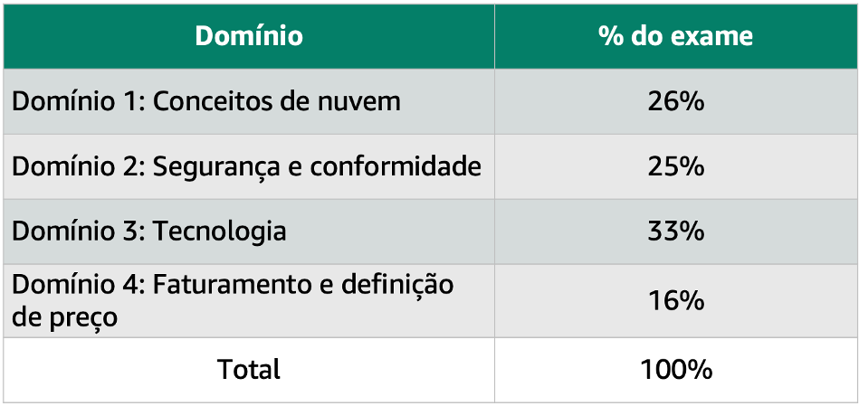

+++ 
title = "Visão geral do exame" 
chapter = true 
weight = 15 
+++

|  |  |
| ------ | ----------- |
| **Nível**  | Básico |
| **Duração** | 90 minutos para concluir o exame |
| **Custo** | 100 USD |
| **Formato** | 65 perguntas de múltipla escolha ou com várias respostas |

Consulte <a href="https://aws.amazon.com/pt/certification/policies/before-testing/#Exam_pricing" target="_blank">Preço do exame</a> para obter informações adicionais sobre o custo de outros exames de certificação.

#### Informação adicional:

- A pontuação mínima de aprovação é 700 (a pontuação máxima é 1000).

- O exame está disponível em inglês, espanhol, **português**, entre outros idiomas.

- As certificações da AWS são válidas por 3 anos. Consulte para mais detalhes: <a href="https://aws.amazon.com/pt/certification/recertification/" target="_blank">Recertificação AWS</a>.

- Uma extensão de 30 minutos está disponível mediante solicitação para falantes não nativos de inglês fazendo o exame em inglês **antes de agendar o exame**. Se você fizer um exame em inglês, poderá solicitar uma extensão de 30 minutos se não for um falante nativo de inglês. A adequação do “ESL 30” só precisa ser solicitada uma vez antes da inscrição para o exame. Ele se aplicará a todos os registros futuros com todos os provedores de avaliação. Para solicitar este adequação, siga estes passos:

	- Inicia a sessão em {}AWS Certification{}

	- Selecione **Go to your Account**.

	- Selecione **Solicitar adaptações para o exame** (Request Exam Accommodations) em seguida **Solicitar acomodação** (Request Accommodation).

	- No menu suspeson **Selecionar adaptação** (Accommodation Type), selecione **ESL +30 MINUTOS** (ESL +30 MINUTES).
	
	- Selecione **Criar**.

O exame AWS Certified Cloud Practitioner inclui quatro domínios:

Os domínios cobertos descrevem cada aspecto do guia do exame de certificação AWS Certified Cloud Practitioner. Para uma descrição de cada área, consulte o site da <a href="https://aws.amazon.com/pt/certification/certified-cloud-practitioner/" target="_blank">AWS Certified Cloud Practitioner</a>.

Cada domínio do exame será ponderado. O peso representa a porcentagem de questões do exame que se enquadram nesse domínio específico. Essas são aproximações, portanto, suas perguntas do teste podem não corresponder exatamente a essas porcentagens. No exame, a área associada a uma questão não é indicada. De fato, é possível que algumas questões correspondam a diversas áreas.

{}Informações úteis e políticas relevantes para os candidatos antes de agendar qualquer exame da AWS Certification <a href="https://aws.amazon.com/pt/certification/policies/before-testing/" target="_blank">Consulte antes do teste.</a>
{}

